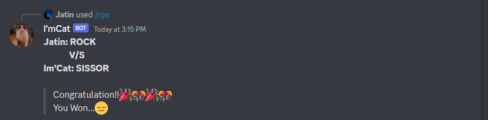
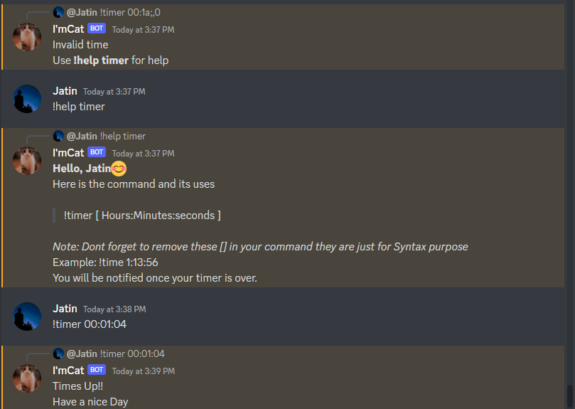
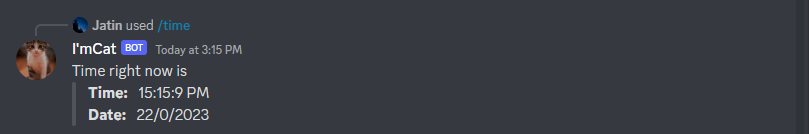

# I'mCat

### A discord bot developed in NodeJS/@discord.js-v14, a fun project with multiple functionalities like a rock paper scissor game.

<br>

---

## Features

- **Rock Paper Scissor**: _A fun game where you can play Rock Paper Scissors with the Bot._
- **Timer**: _Users can set a timer for a specific time and then continue their work, they will be informed once the timer is over._
- **Time**: _Users can check the current date & time._

<br>

---

## Setup

Clone the repository to your local machine and then use the use the following commands in your terminal

```Bash
$ cd ImCat
$ npm install
```

Now make a `.env` file for environment variables in the root(ImCat) directory and put your `Bot Tokens, Guild IDs` in it.

```Bash
$ node src/regSlashCmd.js
$ node src/.
```

And you are all set 😀

For more information use this [resource](https://www.youtube.com/watch?v=7rU_KyudGBY)

<br>

---

## TechStack

- NodeJS
- discord.js

<br>

---

**Jatin#5072** 

<a href="https://www.linkedin.com/in/jatin-sharma-a4b08b22b/"></a>
